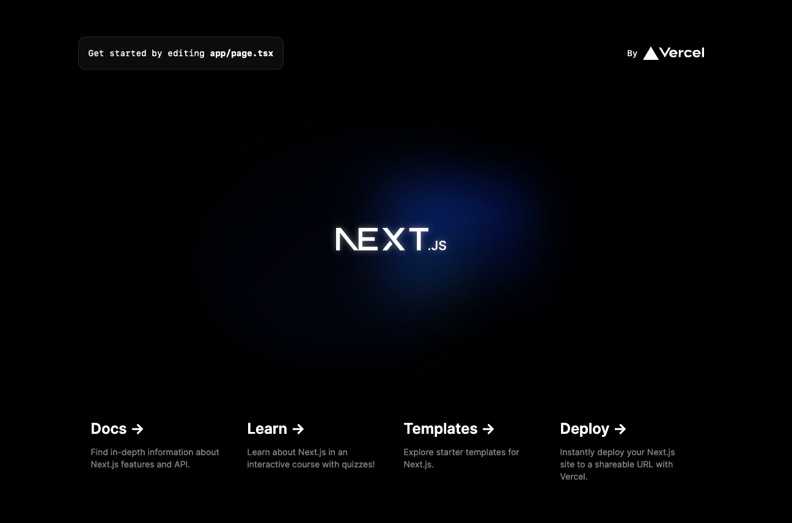

# BUG REPORT: Next.js custom server with express

## Project structure

- `server`: is a extremely simple server with express, only single file `server.js`.
- `ui`: is a Next.js app, generated with `npx create-next-app`. **App Router**

## How to reproduce

### Install dependencies

```bash
pnpm install
```

### Next.js is fine

```bash
pnpm dev:ui
```



### Run custom server

```bash
pnpm dev:server
```


<h1>Tailwindcss not working....</h1>

```log
warn - The `content` option in your Tailwind CSS configuration is missing or empty.
warn - Configure your content sources or your generated CSS will be missing styles.
warn - https://tailwindcss.com/docs/content-configuration
```

### Run `express.js` in `ui` directory

`express.js` file in `ui` directory is a copy of `index.js` in `server` directory.

```bash
pnpm dev:ui:server
```


<h1>Everything is fine now!</h1>
